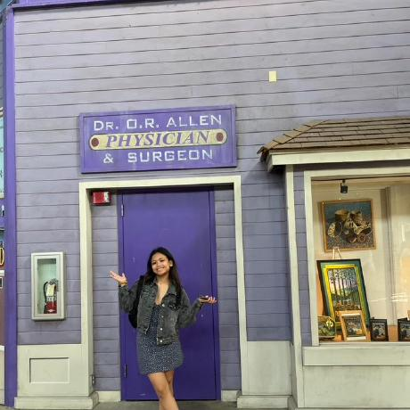

## Education
**Columbia University, Mailman School of Public Health**

Masters of Science in Environmental Health Data Science 

New York, NY - Sept 2025 - May 2026

**University of Washington, School of Oceanography**

Bachelor of Science in Oceanography

Seattle, WA - Sept 2022 - June 2025

**Everett Community College, Ocean Research College Academy (ORCA)**

Associates of Arts and Science

Everett, WA - Sept 2020 - June 2022

## Clinical and Research Experience

**Lynnwood Vision Center, Optometric Assistant**

Lynnwood, WA - May 2022 - August 2025

* Assisted with patient pre-testing, appointment scheduling, billing, and insurance verification

* Developed strong patient communication skills and maintained an efficient clinical workflow

* Collaborated with healthcare providers and insurance companies to coordinate care

**Snohomish County, Department of Natural Resources, Marine Ecology Intern**

Everett, WA - June 2024 - September 2024

* Collected marine ecological data, including forage fish surveys and water quality sampling

* Co-developed shoreline health assessment protocols

* Participated in public outreach and interagency collaboration on environmental health projects

**GEOPATHs / National Science Foundation, Undergraduate Researcher**

Everett, WA - July 2021 – May 2022

* Designed and executed an independent research project on plankton trends in the Snohomish River Estuary

* Analyzed ecological data and presented findings at research symposiums

* Strengthened skills in scientific communication, data interpretation, and hypothesis testing

## Leadership and Extrat Curricular Activities
**University of Washington Spirit Program, Cheer Coed Flyer**		                 April 2022- June 2025

* Represented UW at NCAA Division I events including UCA Nationals (3rd Place, D1A Spirit Gameday, 2025) and ESPN’s College Gameday (UW vs. Oregon 2023, UW vs. Indiana 2024)

* Selected for travel team to 2024 College Football Playoffs and National Championship

* Developed discipline, resilience, and advanced teamwork in high-pressure environments

**UW First Year Programs (FYP), First-year Interest Groups (FIG) Leader**

February 2024 – December 2024

* Designed and facilitated weekly seminars to ease first-year students’ academic and social transition

* Mentored students in academic planning, campus engagement, and personal wellness

* Fostered a supportive learning environment while promoting university resources and community building

**Washington State House of Representatives, Page**

April 2019

* Delivered legislative documents and attended House Floor proceedings

* Received “The Legy Award” for an exemplary presentation on the process of turning a bill into law